<div align="center">

#  CSE STUDENT • ML ENTHUSIAST • OPEN SOURCE CONTRIBUTOR

</div>

<div align="center">


<br/>
<a href="https://sourabh-portfolio-link.example.com"></a>
<a href="https://www.linkedin.com/in/sourabh-verma-0b480036b/"></a>
<a href="mailto:sverma25072006@gmail.com"></a>
<a href="https://github.com/CODE-BUG25"></a>


</div>
<br/>

</div>

<div align="center">
  
</div>


---

<h2 align="center">👋 Hi, I'm Sourabh Verma</h2>


<p align="center">
  
  
  
</p>

<div align="center">

🎓 **CSE STUDENT @ KIET GROUP OF INSTITUTIONS**

Learning machine learning and data science the deep way — one concept at a time, no shortcuts.

_Some things I'm proud of right now:_


</div>

---

## 🧭 About Me

```yaml
Name: Sourabh Verma
Role:
  - CSE Student, KIET Group of Institutions
  - Open Source Contributor (GSSoC)
  - ML & Data Science Learner

Focus:
  - Machine Learning & Data Science
  - Data Structures & Algorithms
  - Space Technology
  - Entrepreneurship

Mission: >
  Learn deeply, build honestly, and turn
  curiosity into real, working projects.

Status: Always Learning 🚀
```

---

## ⚡ Coder In Action

<div align="center">
  
    

</div>

---

## 🚀 What I Love Building

<table align="center">
<tr>
<td align="center">🤖<br/><b>ML Projects</b></td>
<td align="center">📊<br/><b>Data Science</b></td>
<td align="center">🧩<br/><b>DSA Practice</b></td>
</tr>
<tr>
<td align="center">🛰️<br/><b>Space Tech Explorations</b></td>
<td align="center">🌐<br/><b>Web Projects</b></td>
<td align="center">🛠️<br/><b>Open Source</b></td>
</tr>
</table>

---


## 🧠 Tech Universe

<div align="center">
  
</div>

---

# 🛠️ Tech Stack


## Languages
<p align="center">
    
</p>

## Machine Learning & Data

<p align="center">
     
</p>

## Web

<p align="center">
   
</p>

## Tools

<p align="center">
   
</p>

## CAD & Electronics

<p align="center">
  
</p>
  
<br/>
🌌 3D Contribution Graph

<div align="center">

</div>

This graph is generated automatically by a GitHub Action — see the setup note at the bottom of this file to switch it on for your profile repo. Until the workflow runs once, this image won't show anything.


<br/>

## 📈 Contribution Snake

<div align="center">
  
</div>

<sub align="center">⚠️ Generates automatically once you add the <a href="https://github.com/Platane/snk">snk snake workflow</a> to your profile repo — happy to write that workflow file for you.</sub>


## 📊 GitHub Analytics

<div align="center">


</div>
<div align="center">

</div>
<br/>

---

<div align="center">
  
</div>

--- 

## 💻 Terminal

```bash
> who am I
Sourabh Verma

> title
CSE Student • ML Learner • Open Source Contributor

> mission
Learn. Build. Share. Grow.

> status
Building, learning, launching 🚀

> current_mood
Coffee + Code + Curiosity ☕
```

---
## 🛠️ Projects Showcase

<div align="center">
  
</div>

<br/>

<table>
  <tr>
    <td width="50%" valign="top">
      <h3>🤖 Machine Learning Journey</h3>
      <p>A structured collection of Jupyter notebooks documenting my end-to-end ML learning — data collection, EDA, feature engineering, data cleaning, and algorithm implementation.</p>
      
      
      
      <br/><br/>
      <a href="https://github.com/CODE-BUG25/Machine-Learning-Journey"></a>
    </td>
    <td width="50%" valign="top">
      <h3>📈 Stock Price Prediction</h3>
      <p>Predicting Netflix stock prices using Machine Learning — from raw price data to trained regression models forecasting future trends.</p>
      
      
      
      <br/><br/>
      <a href="https://github.com/CODE-BUG25/Stock-Price-Prediction"></a>
    </td>
  </tr>
  <tr>
    <td width="50%" valign="top">
      <h3>🚢 Titanic Survival Prediction</h3>
      <p>Predicts passenger survival on the Titanic using age, gender, class, fare, and family size. Includes full data cleaning, EDA, feature engineering, and multi-model comparison.</p>
      
      
      
      <br/><br/>
      <a href="https://github.com/CODE-BUG25/Titanic-Survival-Prediction"></a>
    </td>
    <td width="50%" valign="top">
      <h3>🎯 SkillForge</h3>
      <p>A smart web-based skill gap scanner that analyzes user abilities, identifies missing competencies, and delivers personalized learning paths for students and professionals.</p>
      
      
      
      <br/><br/>
      <a href="https://github.com/CODE-BUG25/SkillForge"></a>
      <a href="https://code-bug25.github.io/SkillForge/"></a>
    </td>
  </tr>
  <tr>
    <td width="50%" valign="top">
      <h3>🎬 Movie Recommendation System</h3>
      <p>A content-based movie recommender using TF-IDF vectorization and cosine similarity to suggest similar Netflix movies based on genre, cast, director, and description.</p>
      
      
      
      <br/><br/>
      <a href="https://github.com/CODE-BUG25/Movie-Recommendation-System"></a>
    </td>
    <td width="50%" valign="top">
      <h3>🛰️ Space Debris Predictor</h3>
      <p>A predictive model exploring space debris tracking and risk forecasting — combining my interest in space technology with applied machine learning.</p>
      
      
      <br/><br/>
      <a href="https://github.com/CODE-BUG25/Space-Debris-Predictor"></a>
      <a href="https://replit.com/@Sourabh25V/Space-Debris-Predictor"></a>
    </td>
  </tr>
  <tr>
    <td width="50%" valign="top">
      <h3>🏛️ LokSamadhan</h3>
      <p>An AI-powered civic grievance platform helping citizens register, track, and resolve public issues — with smart complaint categorization, real-time tracking, multilingual support, and data-driven governance insights.</p>
      
      
      
      <br/><br/>
      <a href="https://github.com/CODE-BUG25/LokSamadhan"></a>
    </td>
    <td width="50%" valign="top">
      <h3>🐦 Twitter Sentiment Analysis</h3>
      <p>An NLP-based project that analyzes tweets and classifies them into Positive, Negative, or Neutral sentiments using text preprocessing, feature extraction, and machine learning techniques.</p>
      
      
      
      <br/><br/>
      <a href="https://github.com/CODE-BUG25/Twitter_Sentiment_Analysis"></a>
    </td>
  </tr>
</table>

<div align="center">
  
</div>

---

## 🌌 Beyond the Code

<table>
  <tr>
    <td width="33%" valign="top" align="center">
      <h3>🏆</h3>
      <h3>Hackathons</h3>
      <p>I enjoy the pressure-cooker energy of hackathons — turning an idea into a working prototype in a tight window. <b>LokSamadhan</b> and <b>SkillForge</b> both grew out of that same build-fast, ship-something-real mindset.</p>
    </td>
    <td width="33%" valign="top" align="center">
      <h3>🛰️</h3>
      <h3>Space Exploration</h3>
      <p>Space technology has fascinated me for as long as I can remember — orbital mechanics, satellites, and the engineering behind missions like JWST. <b>Space Debris Predictor</b> is where that curiosity meets ML.</p>
    </td>
    <td width="33%" valign="top" align="center">
      <h3>🌐</h3>
      <h3>Open Source</h3>
      <p>Actively contributing through <b>GSSoC</b> — I like the collaborative side of building: reading other people's code, submitting PRs, and learning how real-world projects are structured and maintained.</p>
    </td>
  </tr>
</table>

<div align="center">
  <blockquote>
  💭 Whether it's a 24-hour hackathon, a late-night PR, or reading about the next Mars mission —<br/>
  it all comes back to the same thing: <b>building, learning, and staying curious.</b>
  </blockquote>
</div>

---

## 🌍 Community Impact

**Things I love doing**

- 💡 Helping fellow students get into ML & DS
- 🧑‍🏫 Sharing what I learn as I learn it
- 🌐 Contributing to open source through GSSoC
- 🚀 Building and sharing projects in public
- 🛠️ Practicing DSA consistently
- ✨ Encouraging others to start building

---


## 💜 Favorite Quote

<div align="center">

```
"The only thing we have to fear is fear itself."
```

*— Franklin D. Roosevelt*

</div>

---

## 🌐 Let's Connect

<div align="center">
  <a href="https://github.com/CODE-BUG25"></a>
  <a href="https://www.linkedin.com/in/sourabh-verma-0b480036b/"></a>
</div>

<br/>

<div align="center">

💜 **Thanks for visiting**

Learning in public, contributing in the open, and building one commit at a time.

⭐ If you like my work, consider following or starring a project.

</div>

</div>
<br/>
